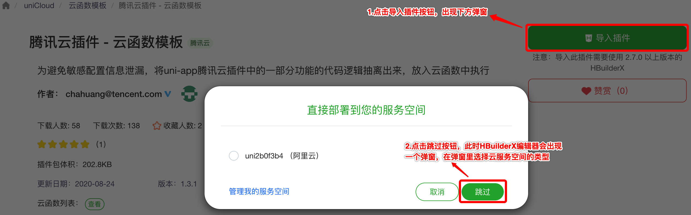
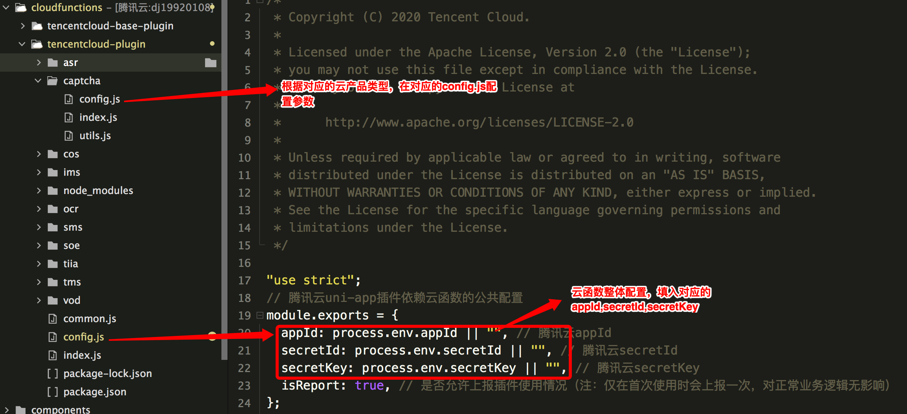
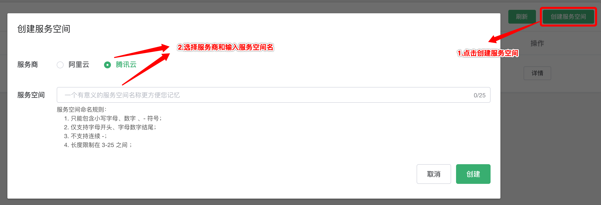
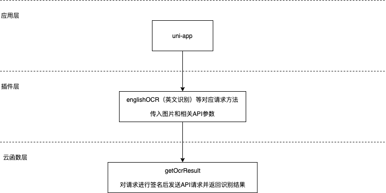

# 腾讯云文字识别（OCR）插件

## 1. 插件介绍
| 标题      | 名称    |
| ----     | ---------------- |
| 中文名称   | 腾讯云文字识别（OCR）插件 |
| 英文名称   | tencentcloud-plugin-ocr |
| 最新版本   | v1.0.0 (2020.07.22) |
| 适用平台   | [DCloud uni-app](https://uniapp.dcloud.net.cn) |
| 适用产品   | [腾讯云文字识别（OCR）](https://cloud.tencent.com/product/ocr) |
| GitHub项目| [tencentcloud-uniapp-plugin-ocr](https://github.com/Tencent-Cloud-Plugins/tencentcloud-uniapp-plugin-ocr) |
| 主创团队   | 腾讯云中小企业产品中心（SMB Product Center of Tencent Cloud） |

一款帮助开发者在uni-app项目开发中快捷使用腾讯云文字识别（OCR）产品功能的插件。

## 2. 功能特性

- 支持印刷体、手写体及定制化场景的图片文字识别服务，有效提升信息录入效率

## 3. 安装指引

本插件需要调用uniCloud云函数，而使用云函数的前提是：

- 使用DCloud官方开发工具HBuilderX 2.7+；
- 已注册DCloud开发者账号并通过实名认证；
- 开通了uniCloud并创建一个腾讯云的服务空间；

### 3.1. 新建或打开已有项目

1. 打开HBuilderX开发工具；
1. 新建或打开一个uni-app项目；

### 3.2. 导入云函数

1. 访问 DCloud 插件市场的 [腾讯云插件 - 云函数模板](https://ext.dcloud.net.cn/plugin?id=2139) 详情页；
2. 点击详情页右上角 **使用 HBuilderX 导入插件**，将云函数模板导入到您的项目中；

3. 在项目中打开 _cloudfunctions/tencentcloud-plugin/config.js_ 文件，将腾讯云的密钥信息配置进去，可以在腾讯云 [API 密钥管理](https://console.cloud.tencent.com/cam/capi) 中获取 SecretId、SecretKey 和 APPID；

4. 在[uniCloud控制台](https://unicloud.dcloud.net.cn/login)注册HBuild账号并登录，创建[云服务空间](https://uniapp.dcloud.net.cn/uniCloud/concepts/space)；

5. 绑定云函数的云服务空间，将[云函数](https://uniapp.dcloud.net.cn/uniCloud/concepts/cloudfunction) [**上传部署**](https://uniapp.dcloud.net.cn/uniCloud/quickstart?id=rundebug) 到您的[云服务空间](https://uniapp.dcloud.net.cn/uniCloud/concepts/space)；


> 如果您之前在使用其它腾讯云产品的 uni-app 插件时已经导入过此云函数模板，则前 4 个步骤可以省略。

> 若导入失败或有其它疑问，请查看 [uniCloud帮助文档](https://uniapp.dcloud.io/uniCloud/README) 云函数相关章节。

### 3.3. 导入插件

1. 访问DCloud插件市场 [腾讯云文字识别（OCR）插件](https://ext.dcloud.net.cn/plugin?id=2364) 详情页；
1. 点击详情页右上角 **使用HBuilderX导入插件** ，将插件导入到您的项目中；
1. 在项目中通过 import 语法将插件提供的方法导入到相关业务组件并使用；

> 本插件的默认导入位置是在您项目的“js_sdk”目录下

## 4. 使用指引

### 4.1. 插件API导图



### 4.2. 插件API列表

|  API名称   | API对应方法名  |
|  ----  | ----  |
|  **行业文档识别接口**  | ----  |
| 表格识别  | tableOCR |
| 算式识别  | arithmeticOCR |
| 数学公式识别  | formulaOCR |
| 数学试题识别  | eduPaperOCR |
| 保险单据识别  | insuranceBillOCR |
| 印章识别  | sealOCR |
|  **卡证文字识别相关接口**  | ----  |
| 护照识别（港澳台地区及境外护照）  | mlidPassportOCR |
| 港澳台来往内地通行证识别  | mainlandPermitOCR |
| 港澳台居住证识别  | hmtResidentPermitOCR |
| 户口本识别  | residenceBookletOCR |
| 房产证识别接口  | businessCardOCR |
| 营业执照识别  | bizLicenseOCR |
| 银行卡识别  | bankCardOCR |
| 组织机构代码证识别  | orgCodeCertOCR |
| 事业单位法人证书识别  | institutionOCR |
| 不动产权证识别  | estateCertOCR |
| 企业证照识别  | enterpriseLicenseOCR |
| 护照识别（中国大陆地区护照）  | passportOCR |
| 港澳台通行证识别  | permitOCR |
| 身份证识别  | idCardOCR |
|  **票据单据识别接口**  | ----  |
| 增值税发票识别  | vatInvoiceOCR |
| 运单识别  | waybillOCR |
| 金融票据切片识别  | finanBillSliceOCR |
| 金融票据整单识别  | finanBillOCR |
| 增值税发票（卷票）识别  | vatRollInvoiceOCR |
| 过路过桥费发票识别  | tollInvoiceOCR |
| 轮船票识别  | shipInvoiceOCR |
| 混贴票据识别  | mixedInvoiceOCR |
| 混贴票据分类  | mixedInvoiceDetect |
| 通用机打发票识别  | invoiceGeneralOCR |
| 汽车票识别  | busInvoiceOCR |
| 火车票识别  | trainTicketOCR |
| 完税证明识别  | dutyPaidProofOCR |
| 出租车发票识别  | taxiInvoiceOCR |
| 定额发票识别  | quotaInvoiceOCR |
| 机票行程单识别  | flightInvoiceOCR |
| 购车发票识别  | carInvoiceOCR |
|  **汽车场景相关接口**  | ----  |
| 行驶证识别  | vehicleLicenseOCR |
| 车牌识别  | licensePlateOCR |
| 驾驶证识别  | driverLicenseOCR |
| 车辆VIN码识别  | vinOCR |
| 机动车登记证书识别  | vehicleRegCertOCR |
|  **通用文字识别接口**  | ----  |
| 英文识别接口  | englishOCR |
| 通用印刷体识别  | generalBasicOCR |
| 通用印刷体识别（高精度版）  | generalAccurateOCR |
| 通用印刷体识别（高速版）  | generalFastOCR |
| 通用手写体识别  | generalHandwritingOCR |
| 二维码和条形码识别  | qrcodeOCR |
| 快速文本检测  | textDetect |

### 4.3. 插件使用示例

```javascript
// 通用文字识别-英文识别使用示例
// 从js_sdk列表中导入需要的api
import { englishOCR } from '@/js_sdk/tencentcloud-plugin-ocr';

export default {
  methods: {
    async eventHandler() {
      try {
        //  图片的网络地址，也可以通过imageBase64参数使用base64形式传入图片，具体可以查看对应api的参数说明
        const img = 'https://ocr-demo-1254418846.cos.ap-guangzhou.myqcloud.com/general/EnglishOCR/EnglishOCR1.jpg'; 
        //  调用api获取识别结果
        const { result } = await englishOCR({imageUrl: img});
      } catch (error) {
        console.log(error);
      }
    }
  }
};
```

### 4.4. 名词解释

服务空间：一个服务空间对应一整套独立的云开发资源，包括数据库、存储空间、云函数等资源。服务空间之间彼此隔离。更多详情请访问 [uniCloud开发文档](https://uniapp.dcloud.io/uniCloud/concepts/space)

云函数：云函数是运行在云端的JavaScript代码，更多详情请见 [uniCloud云函数文档](https://uniapp.dcloud.io/uniCloud/cf-functions)

## 5. 获取入口

| 插件入口      | 链接    |
| ----     | ---------------- |
| DCloud插件市场 | [腾讯云文字识别（OCR）插件](https://ext.dcloud.net.cn/plugin?id=2364) |

## 6. GitHub版本迭代记录

### 6.1. tencentcloud-uniapp-plugin-ocr v1.0.0

- 支持印刷体、手写体及定制化场景的图片文字识别服务，有效提升信息录入效率

## 7. 联系我们

&nbsp;&nbsp;&nbsp;扫码备注“春雨”来联络到我们</br>
